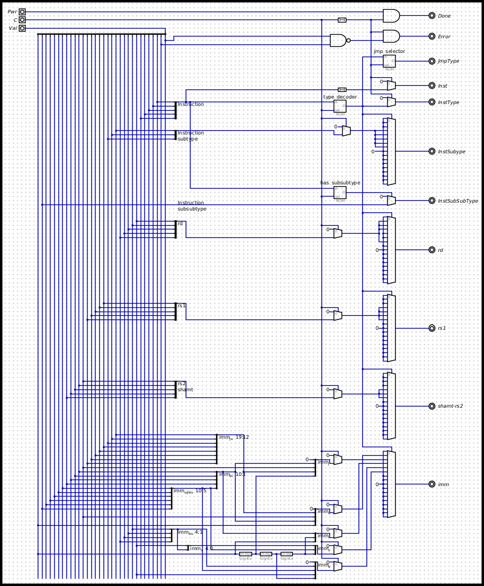

## [RISC-V](https://en.wikipedia.org//wiki/RISC-V) CPU wired with hneeman's [Digital](https://github.com/hneemann/Digital)

- [clockless](https://en.wikipedia.org/wiki/Asynchronous_circuit#Asynchronous_CPU)
- little-endian
- no fuss (no pipeline, not super scalar, no speculative execution, only basic RV32I instructions)
- assumed zero-latency memory

### TODO (maybe one day)
- IO
- memory latency and cache(s)
- privileged mode
- minimalistic assembler
- minimalistic OS
- emulator 

